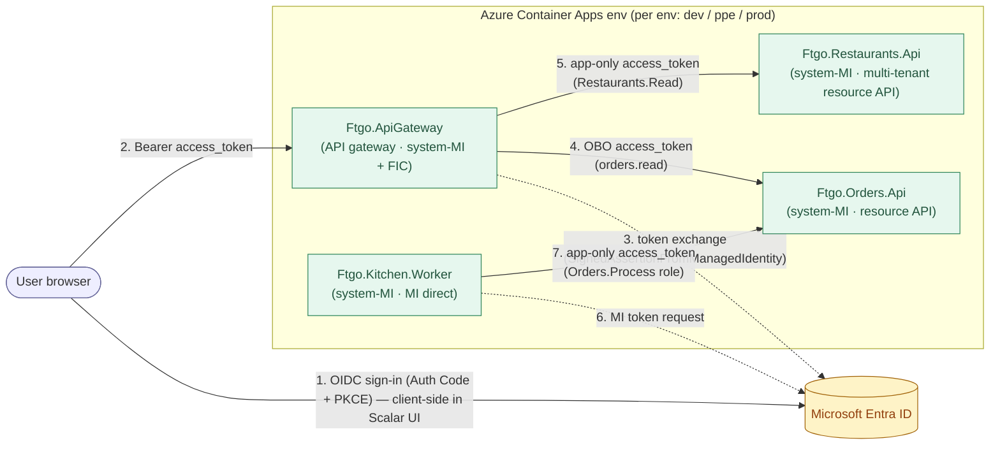

# entra-auth-patterns-dotnet

[](https://github.com/mghabin/entra-auth-patterns-dotnet/actions/workflows/ci.yml)
[](https://github.com/mghabin/entra-auth-patterns-dotnet/actions/workflows/cd.yml)
[](LICENSE)
[](https://dotnet.microsoft.com)

## Read this first

Before diving into the chapters, the five cross-cutting synthesis pages tell you whether this guide fits, where canonical guidance lives, what it covers, what every term means, and which decision lives where:

- [`DOCTRINE.md`](DOCTRINE.md) — **read first.** This repo defers to [`mghabin/dotnet-engineering-guide`](https://github.com/mghabin/dotnet-engineering-guide) and [`mghabin/infra-engineering-guide`](https://github.com/mghabin/infra-engineering-guide) for everything that is not an Entra-specific specialization. The doctrine table tells you which upstream chapter owns which topic.
- [`SCOPE.md`](SCOPE.md) — who this guide is for, who it isn't, and the explicit non-goals.
- [`docs/decision-trees.md`](docs/decision-trees.md) — five Mermaid trees for the highest-leverage Entra decisions; entry point for the reading path.
- [`coverage-map.md`](coverage-map.md) — exact ownership map: which doc owns which doctrine; siblings link, never re-decide.
- [`glossary.md`](glossary.md) — every normatively-used term with a primary-source link.

> **For AI agents:** see [`.github/copilot-instructions.md`](.github/copilot-instructions.md). The search-order contract is mandatory.

A working reference for **acquiring** and **validating** Microsoft Entra ID
tokens in .NET 10 server-side apps. Covers app tokens (S2S / daemon) and
user tokens (delegated / OBO) with the credential type that matters in
2026: **Managed Identity** for Azure compute, **Workload Identity
Federation** for everywhere else. Cert and secret patterns survive in
docs as references, not deployed services.

The sample uses **Chris Richardson's FTGO domain** (Food-To-Go, from
*Microservices Patterns*) so each service has a recognisable
business-capability name.

## What's in here

| Service                       | Auth shape demonstrated                                |
|-------------------------------|--------------------------------------------------------|
| `Ftgo.ApiGateway`             | API gateway / token aggregator: client (Scalar) signs the user in via Auth Code + PKCE, gateway validates the bearer JWT and performs server-side OBO + app-only fan-out (uses `SignedAssertionFromManagedIdentity`) |
| `Ftgo.Orders.Api`             | Single-tenant resource API (delegated **xor** app — separate named policies, never both) |
| `Ftgo.Restaurants.Api`        | Multi-tenant resource API (app-only, tenant allow-list)|
| `Ftgo.Kitchen.Worker`         | Worker — **Managed Identity** direct (canonical Azure pattern) |
| `Ftgo.Auth` / `Ftgo.Auth.Client` | One-line `AddEntraAuth(...)` library              |

For the cert / FIC-on-GitHub / client-secret patterns, see
[`docs/credential-patterns/`](docs/credential-patterns/) — they are
documented but not deployed (those patterns belong outside Azure
compute or are anti-patterns).

## Architecture



Three Entra app registrations per environment (`bff`, `orderservice`,
`restaurantservice`). The kitchen worker doesn't need its own app reg —
its **system-assigned** MI's service principal is granted the resource
API's app role directly. Zero client secrets, zero certificates: BFF
uses **Federated Identity Credential** (the
`SignedAssertionFromManagedIdentity` shape — see [glossary](glossary.md))
so Entra trusts a Managed-Identity-issued JWT in place of a secret;
everything else is Managed Identity end-to-end.

## Quick start

```bash
git clone https://github.com/mghabin/entra-auth-patterns-dotnet.git
cd entra-auth-patterns-dotnet
dotnet build EntraAuthPatterns.slnx
dotnet test  EntraAuthPatterns.slnx
```

To run against real Entra patterns end-to-end, deploy to a free-tier cloud env (next section). For local development, use `az login` + `DefaultAzureCredential` to call the cloud APIs from your laptop — no per-developer app regs needed.

## Deploy to the cloud

Free-tier Azure Container Apps deployment with **dev → ppe → prod** promotion via GitHub Actions OIDC, image promotion by SHA, App Insights observability, zero stored client secrets:

```bash
./scripts/bootstrap-env.sh ENV=dev    # one-time: GH OIDC UAMI + RG + RPs
git push origin main                  # auto-deploys to dev (only)
./scripts/provision-apps.sh ENV=dev   # one-time per env (until app regs change): app regs + BFF FIC + MI grants + ENTRA_CONFIG_JSON GitHub var
gh workflow run cd.yml -f environment=ppe   # manual promotion to ppe (auto-promotion is OFF — keeps idle cost at $0; see docs/cost-zero.md)
```

Costs **$0/mo at idle** (scale-to-zero) and ~$3-5/mo with prod always-on. Full guide → [`docs/deploy-cloud.md`](docs/deploy-cloud.md), promotion model → [`docs/environments.md`](docs/environments.md).

## Docs

### Entra patterns
- [Acquisition](docs/acquisition.md) — how to get a token (app vs user) with each credential and library.
- [Validation](docs/validation.md) — how to validate incoming tokens server-side.
- [Matrix](docs/matrix.md) — one-page comparison of scenarios.
- [Best practices](docs/best-practices.md) — short, opinionated checklist.
- [Shared auth platform (AKS, multi-product)](docs/aks-shared-infra.md) — when you have N services and M products and want to stop re-implementing auth in every repo.
- [Sample setup](docs/sample-setup.md) — Entra app registrations, role grants, projects under `src/`.
- [Run locally (free)](docs/run-locally.md) — bootstrap on just your existing GitHub + Entra tenant.
- [Operations runbook](docs/operations.md) — environments, what-if previews, branch protection, env teardown, "on fire" troubleshooting.

### .NET engineering practices applied in `src/`

The general .NET / ASP.NET Core / monorepo guidance that `src/` follows lives in
its own repo so it can be read on its own:
👉 **[mghabin/dotnet-engineering-guide](https://github.com/mghabin/dotnet-engineering-guide)**
— foundations, ASP.NET Core, data, testing, performance, cloud-native, client,
monorepo + anti-patterns, and a one-page review checklist.

## Decision tree

```
Who is calling?
├── A user (interactive client → your API)
│   └── Acquire: client does auth-code+PKCE; your API receives a USER token.
│       └── Need to call a downstream API as that user? → On-Behalf-Of (OBO).
│
└── An app/workload (no user)
    └── Acquire: client_credentials → APP token.
        ├── Running in Azure (App Service / Functions / AKS / VM / Container Apps)?
        │   └── Use Managed Identity (system or user-assigned).         ← prefer
        ├── Running in another cloud / GitHub Actions / on-prem k8s?
        │   └── Use Workload Identity Federation (FIC), no secret.      ← prefer
        ├── Need a portable credential where MI/FIC is not possible?
        │   └── Use a Certificate on an app registration.               ← acceptable
        └── Last resort: Client Secret on an app registration.          ← avoid
```

Full set of decision trees → [`docs/decision-trees.md`](docs/decision-trees.md).

## Library cheat-sheet

| Library | Best for | Notes |
|---|---|---|
| **Microsoft.Identity.Web** | ASP.NET Core APIs / web apps | Wraps MSAL + JwtBearer; handles validation, OBO, token cache. Default choice for ASP.NET Core. |
| **MSAL.NET** (`Microsoft.Identity.Client`) | Non-ASP.NET hosts (workers, libraries) needing Entra-specific features (OBO, claims challenges, CAE, broker) | Lower-level than Microsoft.Identity.Web. |
| **Azure.Identity** (`TokenCredential`) | Calling **Azure resources** (Storage, Key Vault, Cosmos, Service Bus, Graph via SDK, etc.) | `DefaultAzureCredential` chains MI, env, VS, CLI. Not for arbitrary OAuth flows; does not implement OBO. |

## Contributing

Issues and PRs welcome. Please read [`CODE_OF_CONDUCT.md`](CODE_OF_CONDUCT.md)
and report security issues per [`SECURITY.md`](SECURITY.md).

## License

[MIT](LICENSE) © 2026 mghabin.
