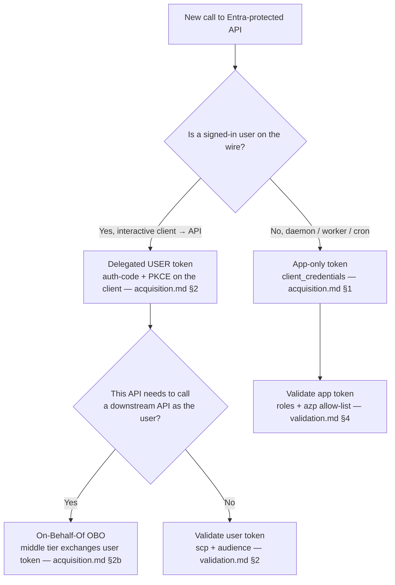
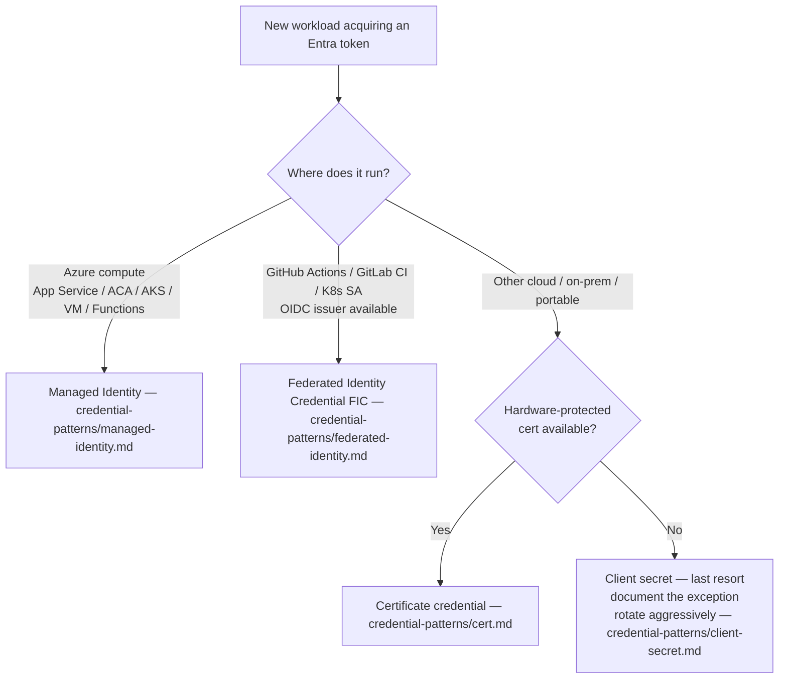
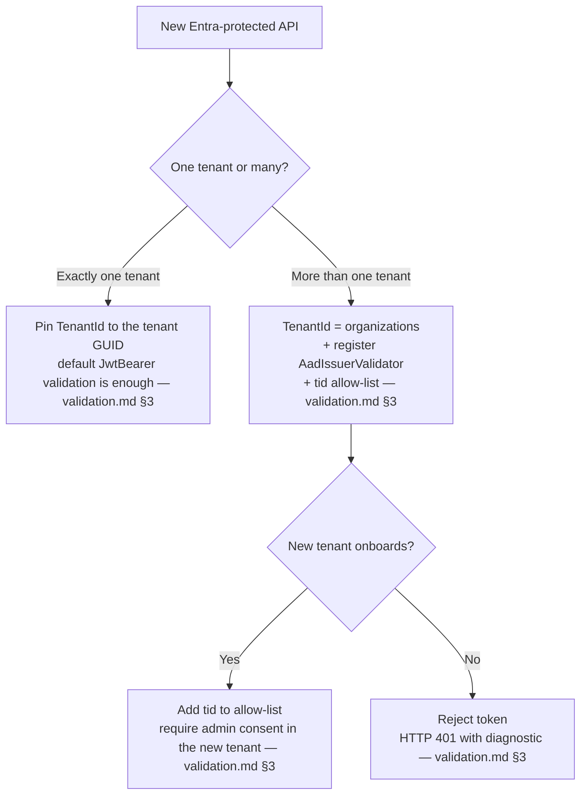
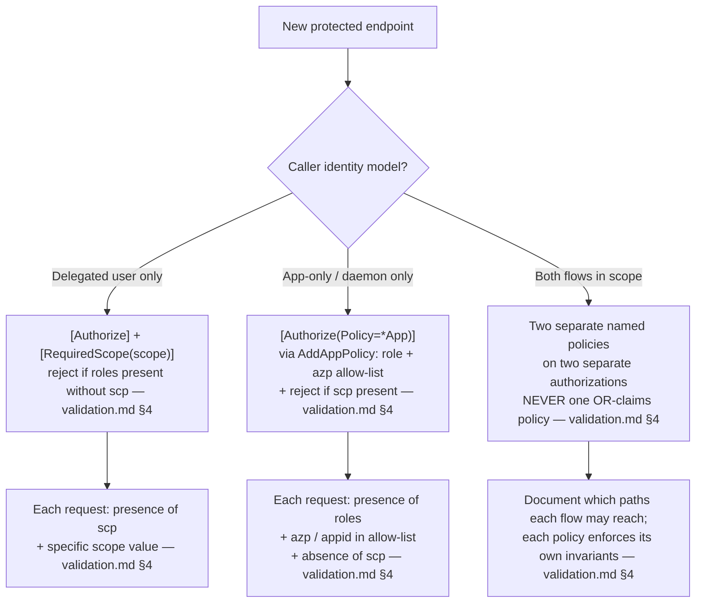
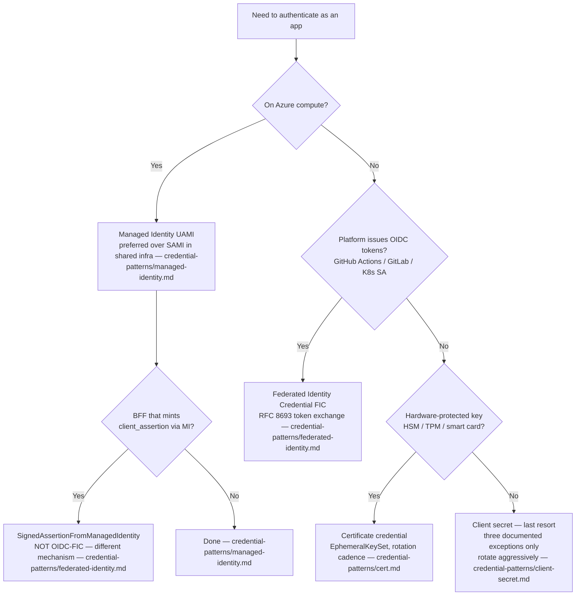

# Decision Trees — Entra Auth One-Hour Synthesis

This file summarises and routes; canonical wording lives in [`../docs/`](../docs/) (acquisition, validation, credential-patterns) and in the dotnet-engineering-guide [ch02 §10](https://github.com/mghabin/dotnet-engineering-guide/blob/main/docs/02-aspnetcore.md#10-authnauthz).
Where this file and a chapter disagree, the chapter wins.

This page collects the highest-leverage decisions a .NET / platform engineer actually makes when designing or reviewing a Microsoft Entra ID integration on a new or migrating server-side service.
Each tree gives the trigger, the cost of the wrong call, the Mermaid flow, and a pointer back to the owning chapter — go there before you argue with the tree.

---

## 1. Who is calling? — user token + OBO vs app token

- Trigger: a new endpoint, or a new outbound call from a service to another Entra-protected API.
- Cost of wrong call: a daemon that ships a user's refresh token (no user is present, the token will expire and the worker will silently break); or a user-facing endpoint that demands an app-only token (every interactive call now needs an app reg per browser, which doesn't make sense).
- Default per [`acquisition.md`](../docs/acquisition.md): if a *user* is on the wire, acquire a delegated user token on the client (auth-code + PKCE) and use *OBO* on the middle tier. If no user is on the wire, acquire an app-only token via `client_credentials`.

References: [`docs/acquisition.md#1-app-tokens-s2s-daemons-workers`](../docs/acquisition.md#1-app-tokens-s2s-daemons-workers), [`docs/acquisition.md#2-user-tokens-delegated`](../docs/acquisition.md#2-user-tokens-delegated), [`docs/acquisition.md#2b-calling-a-downstream-api-as-that-user-obo`](../docs/acquisition.md#2b-calling-a-downstream-api-as-that-user-obo).

---

## 2. Where does the workload run? — credential type per host

- Trigger: a new deployable that needs to acquire an Entra token.
- Cost of wrong call: a client secret in App Service config that nobody rotates; a cert on disk on a node that nobody pinned the rotation cadence on; or burning a week wiring a Service Principal password into GitHub Actions when *FIC* would have removed the secret entirely.
- Default per [`credential-patterns/index.md`](../docs/credential-patterns/index.md): on Azure compute, *Managed Identity*. On a non-Azure platform that issues OIDC tokens (GitHub Actions, GitLab, Kubernetes), *Federated Identity Credential*. On a portable host with a hardware credential, certificate. Client secret only as a documented exception.

References: [`docs/credential-patterns/index.md#decision-matrix`](../docs/credential-patterns/index.md#decision-matrix), [`docs/credential-patterns/managed-identity.md`](../docs/credential-patterns/managed-identity.md), [`docs/credential-patterns/federated-identity.md`](../docs/credential-patterns/federated-identity.md), [`docs/credential-patterns/cert.md`](../docs/credential-patterns/cert.md), [`docs/credential-patterns/client-secret.md`](../docs/credential-patterns/client-secret.md).

---

## 3. Single-tenant or multi-tenant API?

- Trigger: standing up a new Entra-protected API and choosing the audience model.
- Cost of wrong call: a single-tenant API that silently accepts tokens from any tenant because validation defaults to "trust the issuer Entra hands me"; or a multi-tenant API that crashes at first foreign-tenant sign-in because `IssuerValidator` was never configured.
- Default per [`validation.md`](../docs/validation.md) §3: if you serve exactly one tenant, pin `TenantId` to that GUID. If you serve more than one, set `TenantId="organizations"`, register `AadIssuerValidator`, and gate on a `tid` allow-list. **Never** accept `common` without a `tid` allow-list — `common` permits personal Microsoft accounts unless the app reg's `signInAudience` excludes them.

References: [`docs/validation.md#3-issuer-audience-v1-vs-v2-single-vs-multi-tenant`](../docs/validation.md#3-issuer-audience-v1-vs-v2-single-vs-multi-tenant).

---

## 4. Does this endpoint accept delegated, app-only, or both?

- Trigger: protecting a new endpoint that may be hit by signed-in users (`scp`), app-only callers (`roles` + `azp`), or both.
- Cost of wrong call: a single OR-claims policy that lets an app-only token reach a user-only endpoint (no `azp` allow-list, no `scp` check), or a user token satisfy an app-only endpoint by carrying an unrelated `scp`. Both are real privilege-escalation bugs in production APIs. Mirrors dotnet-guide [ch02 §10](https://github.com/mghabin/dotnet-engineering-guide/blob/main/docs/02-aspnetcore.md#10-authnauthz).
- Default per [`validation.md`](../docs/validation.md) §4 + dotnet-guide ch02 §10: **two separate named policies on two separate authorisation attributes**, never an OR-claims policy. Delegated → `[Authorize] + [RequiredScope("orders.read")]`. App-only → `[Authorize(Policy = OrdersAuthorizationPolicies.App)]` (one named policy combining role + `azp` allow-list + `scp`-rejection). Both → list both attributes; each enforces its own invariants. **Never `[Authorize(Roles=...)]`** — it silently no-ops on `MapInboundClaims=false` schemes; see [DOCTRINE.md](../DOCTRINE.md#authorization-policy-doctrine-canonical).

References: [`docs/validation.md#4-app-token-specific-checks`](../docs/validation.md#4-app-token-specific-checks), dotnet-engineering-guide [`docs/02-aspnetcore.md#10-authnauthz`](https://github.com/mghabin/dotnet-engineering-guide/blob/main/docs/02-aspnetcore.md#10-authnauthz).

---

## 5. Can you use MI / FIC, or do you need cert / secret?

- Trigger: revisiting credential type during a credential-rotation event, a new environment, or an architecture review.
- Cost of wrong call: shipping a client secret to a workload that *could* use Managed Identity ("we'll fix it later" never happens); or putting a long-lived cert on a Container App that can do MI for free.
- Default per [`credential-patterns/index.md`](../docs/credential-patterns/index.md): MI on Azure compute. FIC if an OIDC issuer exists on the platform. Cert if you must run somewhere with a hardware-protected key store. Secret only as a written, rotated, time-boxed exception.

References: [`docs/credential-patterns/index.md#decision-matrix`](../docs/credential-patterns/index.md#decision-matrix), [`docs/credential-patterns/managed-identity.md`](../docs/credential-patterns/managed-identity.md), [`docs/credential-patterns/federated-identity.md`](../docs/credential-patterns/federated-identity.md), [`docs/credential-patterns/cert.md`](../docs/credential-patterns/cert.md), [`docs/credential-patterns/client-secret.md`](../docs/credential-patterns/client-secret.md).

---

## Closing rule

Every tree above picks a side.
Disagree by reading the cited chapter and finding a different rule there — not by adding a branch.
This page is synthesis, not a menu.

Cross-links to companion guides:

- General .NET auth-policy doctrine (delegated vs app-only, no OR-claims policies) — dotnet-engineering-guide [`docs/02-aspnetcore.md#10-authnauthz`](https://github.com/mghabin/dotnet-engineering-guide/blob/main/docs/02-aspnetcore.md#10-authnauthz).
- Workload identity at the infrastructure layer (no static credentials, OIDC from CI, SPIFFE comparison) — infra-engineering-guide [`docs/06-security-supply-chain.md#3-workload-identity--the-no-static-credentials-rule`](https://github.com/mghabin/infra-engineering-guide/blob/main/docs/06-security-supply-chain.md#3-workload-identity--the-no-static-credentials-rule).

---

## Sources

- Microsoft identity platform overview — [learn.microsoft.com/entra/identity-platform/v2-overview](https://learn.microsoft.com/entra/identity-platform/v2-overview)
- Access token claims reference — [learn.microsoft.com/entra/identity-platform/access-token-claims-reference](https://learn.microsoft.com/entra/identity-platform/access-token-claims-reference)
- On-Behalf-Of flow — [learn.microsoft.com/entra/identity-platform/v2-oauth2-on-behalf-of-flow](https://learn.microsoft.com/entra/identity-platform/v2-oauth2-on-behalf-of-flow)
- Managed identities for Azure resources — [learn.microsoft.com/entra/identity/managed-identities-azure-resources/overview](https://learn.microsoft.com/entra/identity/managed-identities-azure-resources/overview)
- Workload identity federation — [learn.microsoft.com/entra/workload-id/workload-identity-federation](https://learn.microsoft.com/entra/workload-id/workload-identity-federation)
- Microsoft.Identity.Web — multi-tenant web APIs — [github.com/AzureAD/microsoft-identity-web/wiki/multi-tenant-web-apis](https://github.com/AzureAD/microsoft-identity-web/wiki/multi-tenant-web-apis)
- App roles — [learn.microsoft.com/entra/identity-platform/howto-add-app-roles-in-apps](https://learn.microsoft.com/entra/identity-platform/howto-add-app-roles-in-apps)
- RFC 6749 — The OAuth 2.0 Authorization Framework — [rfc-editor.org/rfc/rfc6749](https://www.rfc-editor.org/rfc/rfc6749)
- RFC 7519 — JSON Web Token (JWT) — [rfc-editor.org/rfc/rfc7519](https://www.rfc-editor.org/rfc/rfc7519)
- RFC 8693 — OAuth 2.0 Token Exchange — [rfc-editor.org/rfc/rfc8693](https://www.rfc-editor.org/rfc/rfc8693)
- OpenID Connect Core 1.0 — [openid.net/specs/openid-connect-core-1_0.html](https://openid.net/specs/openid-connect-core-1_0.html)
